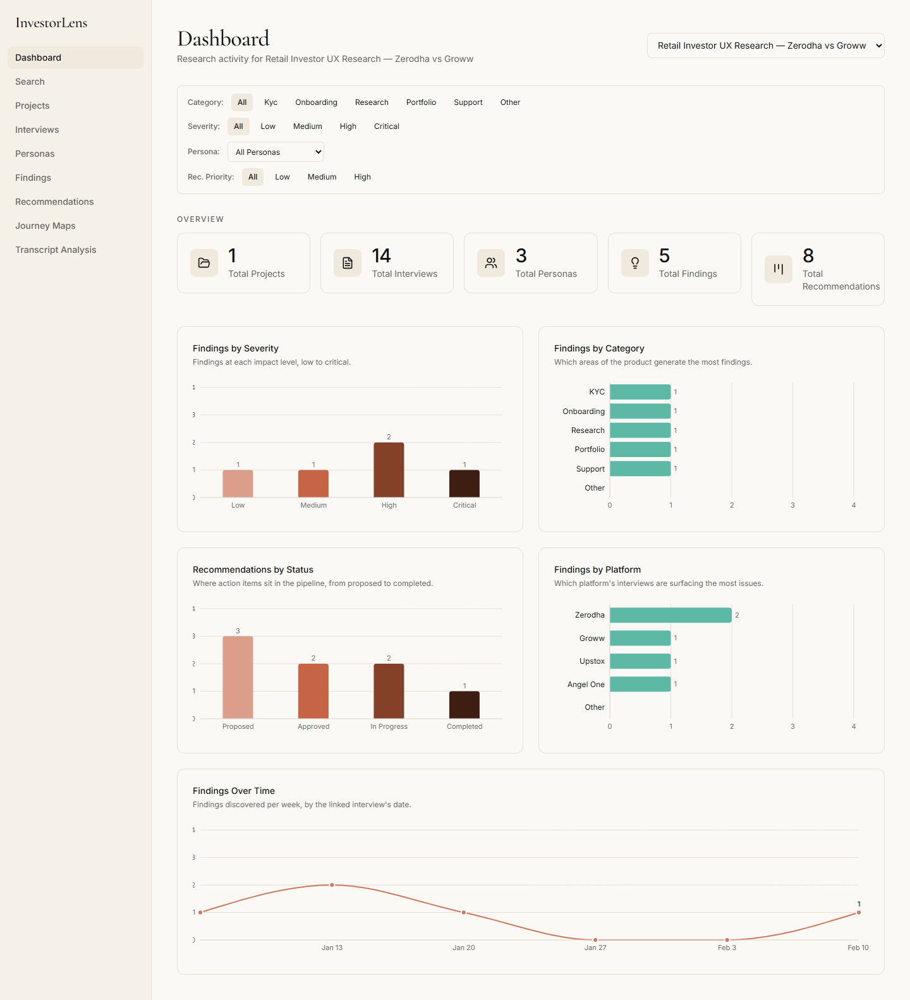
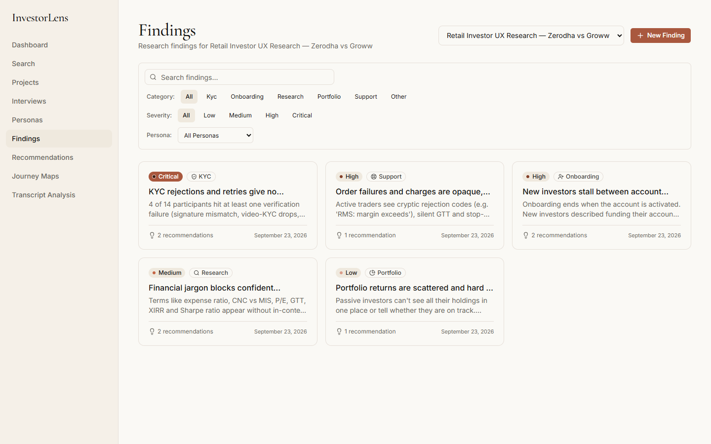
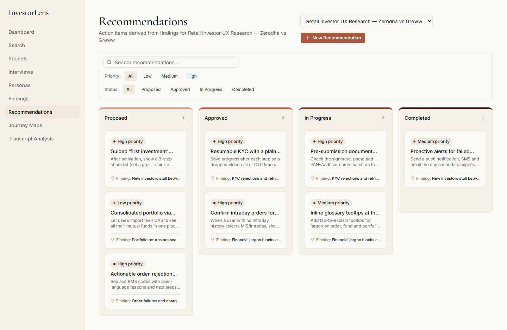
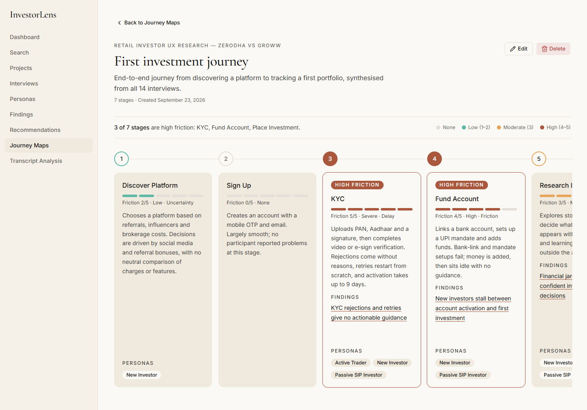

# InvestorLens

A local-first UX research workspace that links interviews to findings, recommendations, personas and journey maps, with an opt-in AI assistant that suggests pain points from transcripts but never saves anything a human hasn't approved.

[](https://github.com/AlfredBateman/investorlens/actions/workflows/ci.yml)

There is no hosted demo. It runs on your own machine, and the repo includes a seeded sample study (a fictional retail-investor UX project) so every screen has data from the first launch.

## Screenshots

All captured from the seeded sample data.

| | |
|---|---|
|  |  |
| **Dashboard** — live counts and five charts, optionally scoped to one project | **Findings** — filter state lives in the URL, so a filtered view is a shareable link |
|  |  |
| **Recommendations** — a board grouped by status (display-only; edit a card to change its status) | **Journey map** — stages with a 0–5 friction rating and linked findings and personas |


**AI transcript review** — every suggestion is approved or rejected individually; nothing is saved until you click save.

## What it does

A research project is one container. Everything inside it is linked:

```text
Project
  └── Interviews  →  Findings  →  Recommendations
          │              │
          └→ Personas    └→ Journey-map stages (which also link to Personas)
```

- **Projects** — name, description and status (Active / Completed / Archived). Deleting a project deletes everything in it.
- **Interviews** — one record per participant: age, occupation, employer, investing platform, goals and frustrations, date and full notes.
- **Findings** — a pain point with a category (KYC, Onboarding, Research, Portfolio, Support, Other) and severity (Low to Critical), optionally tied to the interview that surfaced it.
- **Recommendations** — a proposed fix tied to one finding, with a priority and a status (Proposed → Approved → In Progress → Completed), shown as a board.
- **Personas** — a synthesized user type linked to the interviews it came from.
- **Journey maps** — an ordered list of stages, each with a friction rating (0–5), an optional pain type, and links to supporting findings and personas. Stages rated 4–5 are flagged.
- **Dashboard** — five stat cards and five charts (findings by severity, category and platform; recommendations by status; findings over time), all computed per request from the database.
- **Search and filters** — one search box across interviews, findings, personas and recommendations in a project. Filters on the list pages are URL search params.
- **Printable report** — `/report/[projectId]` renders an executive summary (written from the data), participants, findings, personas, journey maps, recommendations and charts. "Print / Save as PDF" uses the browser's print dialog; there is no PDF library.
- **AI transcript analysis** — opt-in and off by default. See below.

## AI transcript analysis

`/ai/transcripts` lets a researcher paste or upload an interview transcript (`.txt` or `.md`, up to 60,000 characters). It sends the transcript and the project's existing findings to Google's Gemini API and gets back up to 15 candidate pain points. Each one has a quote, a one-sentence summary, and either a match to an existing finding or a proposed title, category and severity for a new one.

The interesting part isn't the model call, it's what surrounds it. **The model's output is treated as untrusted input, and a human is the only path to the database.**

```text
transcript ─► Gemini ─► Zod-validate ─► downgrade / flag / cap ─► review UI ─► human approves ─► re-validate ─► one transaction
                                                                     ▲                                           (server)
                                                   nothing is written before this point
```

**Between the model and the screen** (`src/server/ai/transcript.ts`):

- **Schema-validated.** The reply is requested against a JSON schema and then parsed with Zod. A reply with the wrong shape throws and the user sees an inline error. Nothing half-valid gets through.
- **Quotes are checked against the transcript.** Each quote is compared with the transcript after lowercasing and collapsing whitespace. If it doesn't appear, the suggestion is flagged in the UI ("doesn't appear word-for-word, check it before approving"), so a paraphrased or invented quote is visible before it becomes evidence.
- **Unknown finding ids are downgraded.** If the model claims a suggestion supports a finding id that isn't in this project, it is treated as a new-finding suggestion instead of being trusted.
- **Capped and cleaned.** At most 15 suggestions. Empty quotes or summaries are dropped, and a blank title falls back to the start of the summary.
- **Prompt-injection stance.** The prompt tells the model the transcript is data, not instructions, and the transcript is fenced in delimiters. This is a mitigation, not a guarantee. The real defense is structural. The model has no tools and can't write anything. Its output can only become a suggestion that a person reads and approves.

**Between the screen and the database** (`src/server/actions/ai.ts`):

- **Nothing is saved at extraction time.** `extractSuggestions` makes no database writes.
- **Approve or reject per suggestion.** For new findings the title, category and severity are editable first. Approving a match appends the quote to that finding's description as supporting evidence. Approving a new suggestion creates a finding.
- **Re-validated on save.** The approved decisions come back as JSON and are validated again with Zod. Every finding id and the interview id are re-checked against the project, and the writes run in one transaction, so a bad id changes nothing.
- **The interview link is locked during review.** Once suggestions are on screen the interview select is disabled, so approved findings can't silently relink to a different interview.
- **The key stays server-side.** `GEMINI_API_KEY` is read only in server code. Gemini is called with plain `fetch` (no SDK) with a 90-second timeout, and missing-key and failure states are shown inline.

The pure pieces (envelope parsing, the verbatim check, id downgrading, the cap, error extraction) have a self-check script, `npm run check:ai`, which runs in CI.

Scope is deliberately narrow: one transcript at a time, findings only, no clustering across interviews. The Gemini call has no retries or backoff (during development the API answered a few requests with a 503 "high demand" error, which the UI shows as a failed extraction). Transcript text is sent to Google when the feature is used, and the page says so.

## Tech stack

| Layer | Choice |
|---|---|
| Framework | Next.js 16 (App Router, Server Components, Server Actions), React 19 |
| Language | TypeScript (strict) |
| Database | SQLite (one local file, `prisma/dev.db`) via Prisma and the `better-sqlite3` driver adapter |
| Styling | Tailwind CSS v4, Base UI (`@base-ui/react`) primitives in a shadcn-style layout, `DESIGN.md` tokens |
| Charts | Recharts |
| Validation | Zod, used by every server action |
| AI (optional) | Google Gemini over `fetch`, no SDK |
| Tooling | ESLint, `tsx`, GitHub Actions |

No Docker, no database server and no auth provider.

## Architecture

```text
Browser ── HTML/RSC stream, form POSTs ──► Next.js server (one Node process)
                                              ├─ app/**/page.tsx      Server Components ──► server/queries/*  ─┐
                                              ├─ server/actions/*     "use server": FormData → Zod → Prisma    ├─► Prisma ─► prisma/dev.db
                                              │                       → revalidatePath → redirect / ActionResult ─┘
                                              └─ server/ai/*          Gemini client + validation ──► (optional) Google Gemini API
```

- **State lives in the URL or the database.** The selected project, filters and search text are search params, and there is no client store. A filtered view is a link, and back and forward behave.
- **Server Actions return an `ActionResult`.** The shape is `{ error?: fieldErrors, message?: string, success?: boolean }`. Field errors render inline and messages become toasts. Creates and deletes `redirect()` on success. Failures are returned rather than thrown, because production builds strip the message from thrown action errors.
- **Every page renders per request.** The `(app)` layout calls `connection()`, so SQLite reads are never baked in at build time. The dashboard can't go stale, and the build doesn't need a database.
- **The server owns project boundaries.** Update actions read an entity's `projectId` from the database rather than the form, and verify that linked interviews, findings and personas belong to that project. A crafted POST can't move or cross-link records between projects.

## Getting started

Needs Node.js 20.9 or later (CI runs Node 22) and npm.

```bash
npm install                 # also runs `prisma generate`
cp .env.example .env        # Windows: copy .env.example .env. Every variable is optional
npx prisma migrate dev      # creates prisma/dev.db from the migrations
npx prisma db seed          # loads the sample study (see below)
npm run dev                 # http://localhost:3000
```

The seed wipes all existing data before loading the sample project, so don't run it against data you want to keep.

**Sample data:** "Retail Investor UX Research — Zerodha vs Groww" has 14 fictional participants across Zerodha, Groww, Upstox and Angel One, 3 personas, 5 findings, 8 recommendations and 1 journey map with 7 stages.

**Enabling AI transcript analysis** (optional):

1. Get a key from [Google AI Studio](https://aistudio.google.com/apikey).
2. In `.env`, set `AI_FEATURES=on` and `GEMINI_API_KEY=<your key>`. `GEMINI_MODEL` optionally overrides the default model.
3. Restart the dev server. It reads `.env` at startup.

Transcript text is sent to Google's servers, so don't use real participant data you aren't authorized to share.

### Scripts

| Script | What it does |
|---|---|
| `npm run dev` | Next.js dev server |
| `npm run build` / `npm start` | Production build and server |
| `npm run lint` | ESLint |
| `npm run typecheck` | `tsc --noEmit` |
| `npm run check:ai` | Self-check of the AI validation helpers |

CI (`.github/workflows/ci.yml`) runs `lint`, `typecheck`, `check:ai` and `build` on pushes and pull requests to `main`.

### Troubleshooting

- **"Cannot find module better-sqlite3" or Prisma client errors:** run `npm install` and `npx prisma generate`.
- **Reset the database completely** (deletes everything): `npx prisma migrate reset`, then `npx prisma db seed`.
- **Port 3000 is busy:** `npm run dev -- -p 3001`.
- **`/ai/transcripts` returns not-found:** `AI_FEATURES=on` isn't set, or the server wasn't restarted.
- **Gemini says "API key not valid":** `GEMINI_API_KEY` is missing or has stray whitespace or quotes in `.env`.

## Limitations

- **Local-first and single-user, by design.** There is no authentication or authorization, and no protection against concurrent edits. Anyone who can reach the server can read and change everything, including by calling the Server Actions directly. Hosting it would need auth first.
- **SQLite file storage.** The database path is hard-coded to `prisma/dev.db` relative to the repo root (in `prisma.config.ts` and `src/lib/db.ts`). It needs a persistent, writable filesystem, so a serverless or ephemeral host would be a poor fit.
- **Little automated testing.** The only tests are the AI self-check script. There are no unit, integration or end-to-end tests, and the Server Actions are never exercised against a database in CI. `lint`, `typecheck` and `build` are the main safety net.
- **AI is a first pass.** One transcript at a time, findings only, no retries or backoff, no rate or cost limiting. The quote check catches paraphrased or invented quotes, but it can't tell whether a real quote actually supports the suggested finding. That judgement is the reviewer's.
- **Modest UI scope.** The recommendations board is display-only (no drag-and-drop or inline status change), the journey-map editor is list-based, lists aren't paginated, and the report's PDF quality depends on the browser's print engine.
- **Persona avatars are a pasted http(s) URL** loaded straight from that host; there is no upload.

**Possible next steps:** authentication and multi-user access, a hosted database, cross-transcript theme clustering, retries for the AI call, drag-and-drop on the board, a visual journey-map editor, and real tests for the Zod schemas and the actions.

## More docs

- [`docs/PROJECT_CONTEXT.md`](docs/PROJECT_CONTEXT.md) — a file-by-file orientation to the codebase
- [`docs/PRD.md`](docs/PRD.md) — product requirements
- [`DESIGN.md`](DESIGN.md) — the visual design system the UI follows

## License and disclaimer

MIT, see [LICENSE](LICENSE). InvestorLens is an independent portfolio project. The sample research scenario uses fictional participants and is not affiliated with Zerodha, Groww, Upstox, Angel One or any other platform it mentions.
